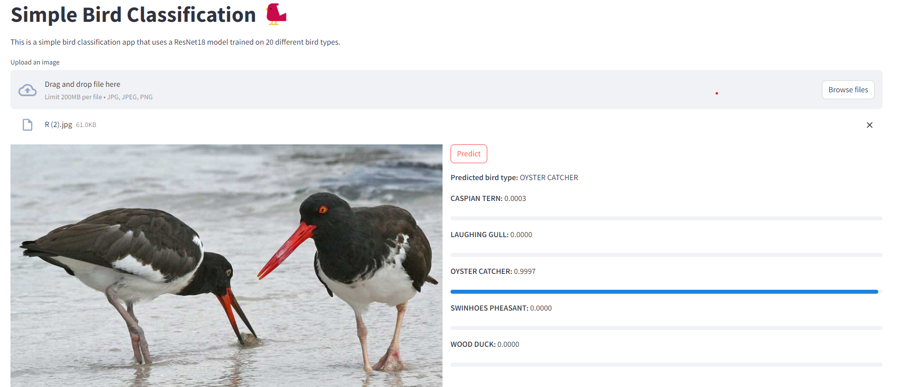

# Bird classifier

This project is a simple bird classification model (CNN) trained on a kaggle dataset. It also has a streamlit and flask app to serve the model. The data and models are stored in google cloud storage.

The initial idea was to train and serve the model in vertexai but because it will cost too much, I decided to train in locally and therefore reduced the dataset a lot. Only on 20 different bird types from the 525. You can find the script to train and deploy using the terminal still in [vertexai train and deploy script](./scripts/train_and_deploy.sh)

However if you want to do more you can specify it as a parameter in the train command below. You can find the [ML canvas](./USE_CASE.md) with more information about the model use case on this link.

Scroll to the bottom of this readme to view the streamlit UI working.

## Learnings

- Pytorch
- Weights and Biases

## Train model

1. Make sure you have the data in the data folder
2. Fill in the correct variables in /src/train_model/.env
3. Run the following command

```python

python ./src/train_model/train.py --data_dir "data" --classes 20 --epochs 10 --batch_size 32 --learning_rate 0.001 --device "cuda" --seed 42 --wandb_project "bird-classification" --model_name "bird_classifier" --save-frequency 1 --refresh_data

# or

bash ./scripts/train_local.sh


```

## Serve model

1. Make sure you have a model trained and in cloud storage!
2. Run the following command

```bash

# This can take a very long time to build
docker compose up

# faster in multiple terminals

python ./src/flask/app.py

# other terminal
streamlit run ./src/streamlit/main.py

```

# Image


